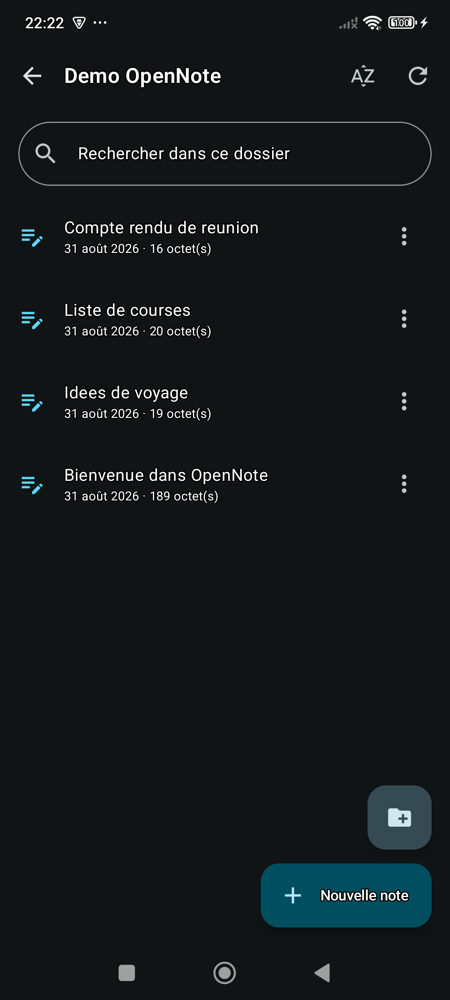
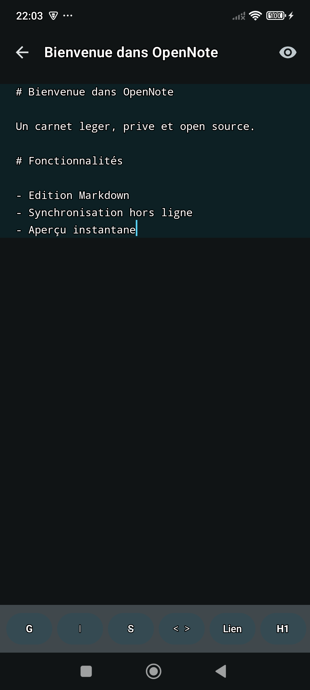
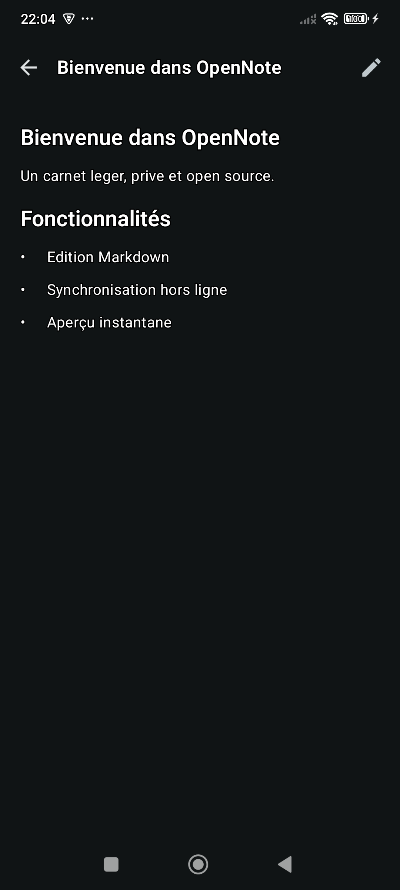

<div align="center">

# OCnotes

**Notes Markdown sur Android — en local ou synchronisées avec OpenCloud.**

[](LICENSE.txt)
[](go.mod)
[](#installation)
[](#état-du-projet)


</div>

## Ce que fait OCnotes

OCnotes est une application Android d'édition de notes **Markdown**. Elles
peuvent vivre uniquement sur l'appareil, sans compte, ou être synchronisées
avec un serveur [**OpenCloud**](https://opencloud.eu) (fork d'ownCloud Infinite
Scale). Avec un serveur, elles restent de simples fichiers `.md` dans votre
espace personnel : lisibles depuis l'interface web et synchronisables avec
n'importe quel autre client.

- 📝 **Éditeur Markdown** avec barre de mise en forme et aperçu rendu nativement
  en Compose (typographie Material 3, thème sombre, sélection de texte).
- 📴 **Local-first** — l'application s'ouvre, se lit et s'écrit hors connexion.
  Les modifications partent dans une file d'attente persistée et se
  synchronisent dès que le réseau revient.
- 📱 **Mode local** — aucun serveur ni compte requis ; les notes restent
  exclusivement sur l'appareil et peuvent être envoyées vers un serveur plus tard.
- 🗂️ **Navigation en arbre** dans vos dossiers de notes, avec création,
  renommage et déplacement.
- ⚔️ **Détection de conflits** par ETag : une note modifiée des deux côtés n'est
  jamais écrasée en silence.
- 📄 **Lecture des `.txt`**, parce qu'OpenCloud crée ses fichiers dans ce format.
- 🌍 **Français, anglais, espagnol, allemand.**
- 🔐 **Authentification par App Token** OpenCloud, stocké en
  `EncryptedSharedPreferences` et jamais écrit sur disque côté Go.

## Captures d'écran





## Installation

Aucune version signée n'est publiée pour l'instant : l'application se construit
depuis les sources (voir [Construire depuis les sources](#construire-depuis-les-sources)).

**Pour la synchronisation** : un serveur OpenCloud accessible en HTTPS et un App
Token créé depuis *Réglages du compte → App Tokens → + New*. Aucun serveur
n'est requis pour utiliser le mode local.

**Prérequis côté appareil** : Android 8.0 (API 26) ou supérieur.

Au premier lancement, l'application propose de continuer sans serveur ou de
saisir l'URL du serveur, le nom d'utilisateur et l'App Token. Le serveur peut
être connecté ou déconnecté plus tard depuis les réglages ; les transitions
annoncent précisément quelles notes seront envoyées, rapatriées ou supprimées.

## Architecture

Le cœur métier est écrit en **Go pur** et relié à une interface
**Kotlin / Jetpack Compose** par `gomobile bind`.

```
internal/opencloud/   client HTTP, auth App Token, LibreGraph, WebDAV   [Go pur]
internal/notes/       arbre de notes, nommage, bootstrap                [Go pur]
internal/store/       cache local, file offline, ETags, conflits        [Go pur]
internal/markdown/    mise en forme, titre, rendu de l'aperçu           [Go pur]
internal/config/      réglages non sensibles                            [Go pur]
mobile/               façade gomobile — contrat gelé avec Kotlin
cmd/ocnotes-cli/     harnais de test desktop
android/              projet Gradle, UI Compose
scripts/              outillage de développement (PowerShell)
```

Trois principes structurent le reste :

1. **Le cœur ignore Android.** Rien sous `internal/` ne connaît gomobile ni
   Compose : tout s'y compile et s'y teste sur desktop.
2. **Local-first.** Une écriture va d'abord sur le disque de l'appareil. En mode
   serveur, elle rejoint ensuite une file persistante et part vers le serveur ;
   en mode local, ce disque est son stockage définitif.
3. **`mobile/` est un adaptateur, pas une couche métier.** Il sérialise,
   désérialise, délègue. Toute règle qui mérite un test vit en dessous.

Les choix techniques, l'organisation du code, le cycle de construction et les
consignes de sécurité sont regroupés dans la
[documentation technique](docs/TECHNICAL.md).

## Documentation

- [Documentation technique](docs/TECHNICAL.md) — architecture, données et
  synchronisation.
- [Guide de développement](docs/DEVELOPMENT.md) — environnement, builds et
  itérations locales.
- [Guide de test](docs/TESTING.md) — tests rapides, intégration et CLI.
- [Guide de publication](docs/RELEASING.md) — signature et préparation d'une
  release Android.
- [Contribuer](CONTRIBUTING.md) — règles de contribution et validation d'une
  pull request.
- [Publier sur F-Droid](docs/fdroid/README.md) — recette d'inclusion et
  conditions déjà remplies.

## Construire depuis les sources

### Prérequis

- Go 1.26+
- JDK 17 et le SDK Android (API 35), NDK compris
- `gomobile` et `gobind` à la version verrouillée dans `go.mod` (le script
  Linux les installe automatiquement)

### Générer le binding Go, puis l'APK

Sous Linux, le script vérifie toute la chaîne, régénère le binding depuis les
sources, exécute les tests Go et Android, puis produit l'APK release :

```bash
bash scripts/build-android-linux.sh
```

La chaîne de référence est Go 1.26.0, JDK 17, Gradle 8.9, les plateformes
Android 26 et 35 et le NDK 27.3.13750724 : celle qu'installe la CI Ubuntu, et
celle sur laquelle sont construits les APK publiés. Le script en contrôle les
*minima*, pas l'égalité — un empaqueteur qui fournit sa propre image, F-Droid
en particulier, obtient un avertissement et non un échec. `OCNOTES_GRADLE_BIN`,
`OCNOTES_NDK_VERSION` et `ANDROID_NDK_HOME` permettent d'imposer chacun des
outils.

Après chaque build CI, l'APK release non signé, l'AAR régénéré et le rapport
lint restent téléchargeables pendant 14 jours dans les artefacts du workflow.

Pour une génération manuelle :

```bash
go install golang.org/x/mobile/cmd/gomobile@v0.0.0-20260821190718-4776eadac327
go install golang.org/x/mobile/cmd/gobind@v0.0.0-20260821190718-4776eadac327
gomobile bind -target=android/arm64,android/amd64 -androidapi 26 -trimpath -ldflags="-s -w" -o android/app/libs/ocnotes.aar ./mobile
```

```bash
cd android && ./gradlew assembleDebug
```

`gomobile bind` a besoin de `ANDROID_HOME` et `ANDROID_NDK_HOME` dans
l'environnement — il ne les découvre pas seul.

> ⚠️ Gradle **ne régénère pas** le `.aar`. Toute fonction ajoutée dans `mobile/`
> exige de relancer `gomobile bind` à la main, sinon Kotlin compile contre
> l'ancien binding et se plaint d'un symbole que vous venez pourtant d'écrire.

## Développement

### Tests

Le cœur métier se teste entièrement sur desktop, sans téléphone ni serveur :

```bash
go test ./... -short
```

```bash
go vet ./... && gofmt -l .
```

Les tests de `internal/opencloud` s'appuient sur des fixtures capturées sur un
vrai serveur OpenCloud 7.0.0 (`internal/opencloud/testdata/`), identifiants
anonymisés. Elles reproduisent notamment le double bloc `propstat` `200`/`404`
et le `$` des identifiants d'espace — deux pièges absents de la documentation
amont.

Côté Android :

```bash
cd android && ./gradlew testDebugUnitTest
```

### Tests d'intégration

Ils s'exécutent contre un vrai serveur, dans un bac à sable horodaté supprimé
en fin de test même en cas d'échec. Ils sont **ignorés** tant que les trois
variables ne sont pas définies, pour qu'un `go test ./...` n'écrive jamais par
accident sur le serveur de quelqu'un :

```bash
export OCNOTES_IT_SERVER="https://cloud.exemple.fr"
export OCNOTES_IT_USER="monlogin"
export OCNOTES_IT_TOKEN="..."
```

```bash
go test ./... -run TestIntegration -v
```

### CLI de test desktop

`ocnotes-cli` exécute le vrai client Go contre un vrai serveur, sans
téléphone. C'est le moyen le plus rapide de vérifier le cœur métier.

```bash
go build -o bin/ocnotes-cli ./cmd/ocnotes-cli
```

Le token se lit dans l'environnement — jamais en argument, où il atterrirait
dans l'historique du shell et la liste des processus :

```bash
export OCNOTES_SERVER="https://cloud.exemple.fr"
export OCNOTES_USER="monlogin"
export OCNOTES_APP_TOKEN="..."
```

```bash
./bin/ocnotes-cli tree
```

Commandes : `drives`, `ls`, `tree`, `cat`, `put`, `mkdir`, `mv`, `rm`.
Les options (`-server`, `-user`, `-drive`, `-timeout`) précèdent la commande.

## État du projet

**Alpha.** L'application fonctionne au quotidien, mais rien n'est encore
distribué et les interfaces peuvent bouger.

- Le **cœur Go est vérifié** : ~200 cas unitaires plus une suite d'intégration
  contre un vrai serveur.
- L'**interface Compose compile et tourne**, mais sa couverture repose sur des
  essais manuels — aucun test instrumenté.

Limites connues :

- Les performances sur les notes très longues restent à améliorer.
- Pas d'OIDC : l'authentification passe uniquement par App Token.
- Le HTML brut d'une note est ignoré à l'aperçu, et les images en `data:` ne
  sont pas affichées (seul leur texte alternatif l'est).
- Les traductions n'ont pas été relues par des locuteurs natifs sur appareil.
- Aucun APK signé n'est publié.
- La chaîne de signature release est prête et testée sur appareil ; la clé doit
  encore être sauvegardée hors ligne avant la première publication.

Feuille de route, par ordre de priorité : virtualisation de l'éditeur, langues
supplémentaires, OIDC, sauvegarde de la clé et distribution de l'APK.

## Contribuer

Les issues et pull requests sont bienvenues. Deux points avant de commencer :

- **Le projet se conduit en français** : code, commentaires, messages d'erreur,
  tests et documentation.

Avant d'ouvrir une pull request :

```bash
go test ./... -short && go vet ./... && gofmt -l .
```

```bash
cd android && ./gradlew testDebugUnitTest lintDebug
```

Les fichiers s'écrivent en **LF** (le dépôt est en LF alors que `core.autocrlf`
vaut `true` sur Windows).

## Sécurité

Pour signaler une vulnérabilité, voir [SECURITY.md](SECURITY.md).

## Licence

[MIT](LICENSE.txt).
